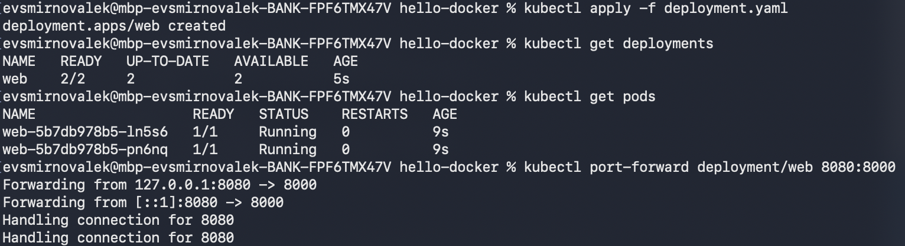
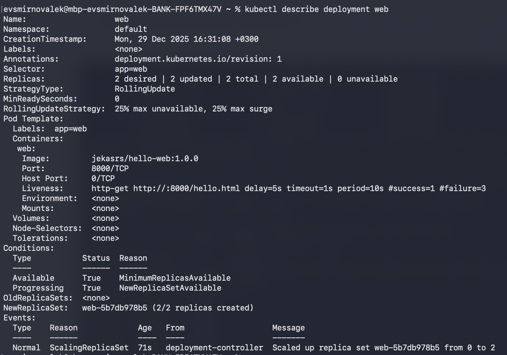
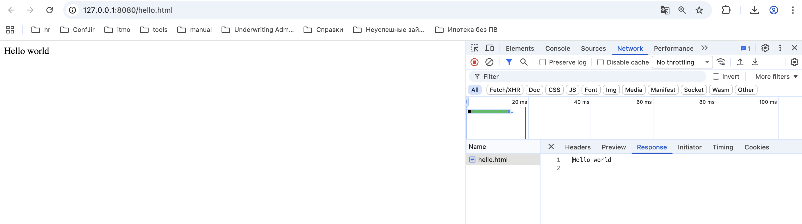

# Kubernetes Web Application (Hello World)
В рамках работы было создано простое web-приложение на Python, контейнеризировано с помощью Docker и развернуто в Kubernetes.

---

## Используемые технологии
- Docker
- Docker Hub
- Python 3.14 (http.server)
- Kubernetes (Docker Desktop)

---

## Docker

### Dockerfile

Образ построен на основе `python:3.14-alpine`.
Файл: [`Dockerfile`](./Dockerfile)

---

### Сборка image

```bash
docker build -t jekasrs/hello-web:1.0.0 .
```
---

### Публикация image в Docker Hub   
```bash
docker push jekasrs/hello-web:1.0.0
```

## Kubernetes

### Deployment

Создан Kubernetes Deployment со следующими параметрами:
- имя: web
- количество реплик: 2
- используется image из Docker Hub
- настроен livenessProbe

Файл: [`deployment.yaml`](./deployment.yaml) 

### Установка Deployment в кластер
```bash
kubectl apply -f deployment.yaml
```



```bash
kubectl get pods
kubectl describe deployment web
```


### Доступ к приложению
Для доступа к приложению использовалась команда kubectl port-forward.
```bash
kubectl port-forward deployment/web 8080:8000
```

После этого приложение стало доступно по адресу: http://127.0.0.1:8080/hello.html



